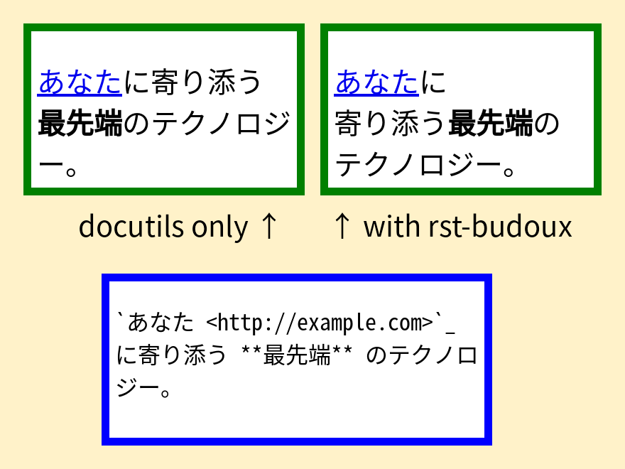

====
Home
====

``rst-budoux`` はreStructuredTextのドキュメントに分かち書きを導入するためのライブラリです。

導入することで、HTMLを始めとした生成物内の日本語に自然な改行をさせることが出来ます。

   動作イメージ

.. note::

   このドキュメントを表示しているウィンドウの横幅を大きくしたり小さくしたりしてみてください。
   単語の途中ではなく、適切なタイミングで改行されていることが分かります。

ドキュメント
============

.. toctree::
   :maxdepth: 1

   installation
   usage
   sphinx-extension
   changes
   api
